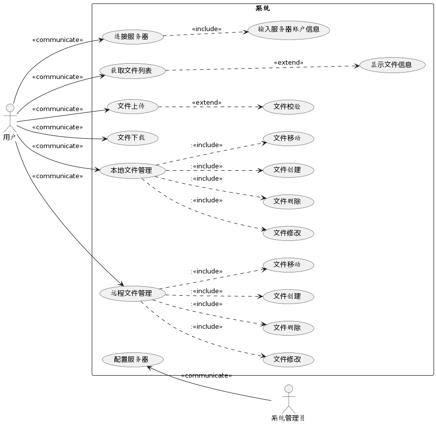

# 概要设计
　　　
##  1、引言

###  1.1 文档目的

本项目建立在cpp-httplib库学习的相关知识体系的基础上，以系统全面的应用所学知识为出发点，设计一个类ftp的文件传输系统，能够实现类似一个 FTP 客户端，可连接到指定的服务端目录，进行交互式的列表、上传、下载。

本文档从功能需求的角度，详细的描述了项目开发锋功能需求以及功能约束内容，为项目设计团队提供一个详细的功能需求说明文档。

###  1.2 文档范围

本文档描述了项目的功能需求，各个功能设计目标，概要设计目标，概要设计，设计约束及各种人机交互的格式要求。

###  1.3 文档对象

项目开发人员

##  2、项目介绍

###  2.1项目背景

####  httplib（XD 项目）

httplib（https://github.com/yhirose/cpp-httplib）是一个 C++ 实现的 HTTP/HTTPS 服务器/客户端开源项目。

####  使用httplib 创建自己的 HTTP 服务器，实现：

- 通过解析配置文件（使用 JSON 格式）得到监听地址。

- 若当前用户为 root，通过配置文件指定运行用户；否则以当前用户运行。

- 通 过 配 置 文 件 指 定 URL 、 处 理 器 、 处 理 器 参 数 ， 如 ： {"url": "/data", "handler": "data", "params": {"dir":
"/var/test/httplib/data"}}。

- 使用工厂模式创建对应的处理器。

- 实现一个读、写二进制文件内容（Content-Type: application/octet-stream）的处理器，可处理定长（有 Content-Length 头部）及变长（使用chunked 格式：https://en.wikipedia.org/wiki/Chunked_transfer_encoding）的传输格式，该处理器通过 上 述 配 置 的 参 数 将 请 求 对 到 指 定 目 录 中 的 文 件 ， 如/data/backup/ubuntu.iso 按 上 述 示 例 目 录 将 对 应 到/var/test/httplib/data/backup/ubuntu.iso 。

- 支持多会话并发上传、下载，可通过配置文件指定最大并发数。

- 可通过配置文件指定 keep-alive 的次数。

####  使用httplib 创建一个 HTTP 客户端程序用于测试上述 HTTP 服务器的文件并发上传、下载功能，实现：

- 可通过命令行参数指定一个本地目录作为测试数据，将该目录中的文件按相同的目录结构上传至服务器，再下载已上传成功的文件，校验数据是否正确（在下载的过程中对数据进行校验，不保存为文件）。

- 可通过命令行参数指定并发的会话数量，为每个会话创建一个独立线程，当超过服务端最大并发数时，排队进行重试。

- 小文件合并功能：当客户端上传的文件较小时（如小于 1 MiB），将多个小文件合并保存为一或多个大文件，并通过一个key-value 数据库保存每个小文件对应的大文件及在该文件中的偏移、大小。

- 目录列表功能：当客户端请求的 URL 对应到一个目录时，以自定义的 JSON 格式返回该目录的文件（及子目录）列表，包含文件的大小、修改时间等属性。

- 交互式客户端：类似一个 FTP 客户端，可连接到指定的服务端目录，进行交互式的列表、上传、下载。
　　
### 2.2 项目特点

该项目具有以下特点：

- 使用 C++ 编程语言实现，具有高效性和跨平台特性。
- 支持 HTTP，保障数据传输的安全性。
- 通过配置文件进行灵活的设置，使得服务器和客户端的行为可以根据需求进行定制。
- 实现了多会话并发上传、下载功能，提高了文件传输的效率。
- 客户端支持小文件合并和目录列表功能，提供更便捷的文件操作。
- 交互式客户端功能类似于 FTP 客户端，让用户可以直观地管理文件和目录。

### 2.3 预期用途

httplib 项目可以应用于多种场景，例如：

- 搭建自己的 ftp文件服务器，用于文件的上传、下载和管理，可在局域网内或互联网上提供文件传输服务。
- 进行 HTTP/HTTPS 文件上传和下载的性能测试和压力测试，验证服务器的性能和稳定性。
- 作为一个文件传输工具，用于将本地目录中的文件批量上传到服务器，或将服务器上的文件批量下载到本地目录。
- 作为一个文件备份工具，用于将本地重要数据备份到远程服务器，或从远程服务器恢复备份数据到本地。

##  3、功能性需求

###  3.1功能汇总

| 模块名 | 功能类别         | 子功能                                                                   |
| ------ | ---------------- | ------------------------------------------------------------------------ |
| 客户端 | 系统启动         | 本地云启动，初始化界面                                                   |
|        | 连接服务器       | 输入服务器账号，密码，ip地址，端口号，登录到服务器获取用户储存的文件列表 |
|        | 文件列表         | 获取文件夹下应该出现的文件列表                                           |
|        | 文件上传         | 上传文件到指定文件夹                                                     |
|        | 文件校验         | 将上传的文件进行下载校验                                                 |
|        | 文件下载         | 从指定文件夹下载文件                                                     |
|        | 本地文件管理     | 对本地文件进行修改                                                       |
|        | 远程文件管理     | 对远程文件进行修改                                                       |
| 服务器 | 服务器启动       | 通过读取json配置文件启动                                                 |
|        | 并发负载         | 初始化线程池                                                             |
|        | 用户接入         | 接收客户端的连接，管理客户端信息                                         |
|        | 处理文件列表请求 | 发送对应的文件目录给对面                                                 |
|        | 处理文件上传     | 接受客户端发送过来的文件并配合进行校验                                   |
|        | 处理文件下载     | 处理客户端请求，发送对应文件                                             |
|        | 文件管理         | 对客户传输的文件进行管理，例如小文件合并                                 |
|        | 数据库           | 服务于文件管理小文件合并                                                 |
|        |                  |                                                                          |


##  4、非功能性需求
| 功能类别   | 功能说明                                     |
| ---------- | -------------------------------------------- |
| 千级并发   | 要求一台服务器能够承受1000台以上的连接数接入 |
| 大并发业务 | 要求一台服务器能承受200-300并发业务处理      |
| 通信架构   | 采用http协议进行进程间通信                   |
| 系统拓展性 | 能够在尽量不修改源代码的前提下，拓展业务     |
| 系统安全   | 承受一些非法操作的轰炸                       |

##  5、系统总体设计

###  5.1系统总体框架

```

@startuml
left to right direction
actor "用户" as fc
actor "系统管理员" as maneger
rectangle 系统 {
  usecase "获取文件列表" as UC2
  usecase "连接服务器" as UC1 
  usecase "文件上传" as UC3
  usecase "文件下载" as UC4
  usecase "本地文件管理" as UC5
  usecase "远程文件管理" as UC6
  usecase "文件校验" as UC7
  usecase "文件修改" as modify
  usecase "文件删除" as remove
  usecase "文件创建" as create
  usecase "文件修改" as rmodify
  usecase "文件删除" as rremove
  usecase "文件创建" as rcreate
  usecase "显示文件信息" as showfileinfo
  usecase "输入服务器账户信息" as login
  usecase "配置服务器" as config
}
UC1 ..> login :<<include>>
fc --> UC1 :<<communicate>>
fc --> UC2 :<<communicate>>
fc --> UC3 :<<communicate>>
fc --> UC4 :<<communicate>>
fc --> UC5 :<<communicate>>
fc --> UC6 :<<communicate>>
UC3 ..>UC7 :<<extend>>
UC2 ..->showfileinfo :<<extend>>

UC5 ..>modify ::<<include>>
UC5 ..>remove ::<<include>>
UC5 ..>create ::<<include>>

UC6 ..>rmodify ::<<include>>
UC6 ..>rremove ::<<include>>
UC6 ..>rcreate ::<<include>>

config<--maneger :<<communicate>>


@enduml


```



###  5.2客户端流程图

```
@startuml
[*] --> Boot
Boot: 加载客户端
Boot -->Connect :成功
Connect : 输入主机，账户密码，端口号

Connect ->Run :成功
Run--> [*] :关闭

state Run {

  Upload -->TaskThreadPoll :添加任务
  Upload -->Fileverification :成功
  Download  -->TaskThreadPoll :添加任务
  Fileverification  -->TaskThreadPoll :添加任务

  Modifyremotefiles  -->mainThread :添加任务
  Modifylocalfiles  -->[*]
  TaskThreadPoll:执行任务
  GetFileList -->mainThread :添加任务
  mainThread:执行任务
}
@enduml

```


###  5.3服务器流程图

```
@startuml
[*] --> Boot
Boot: 启动服务器
Boot -->Config :加载配置，启动
Config : 设置端口，url位置，处理器模式，运行并发数
Config --> TaskThreadPoll :初始化线程池
Config ->Run :成功
Run--> [*] :关闭

state Run {

  HandleUpload -->TaskThreadPoll :添加任务
  HandleUpload -->SmallFileMerge :小文件
  SmallFileMerge -->TaskThreadPoll :添加任务
  HandleUpload -->HandleFileverification :成功
  HandleDownload  -->TaskThreadPoll :添加任务
  HandleFileverification  -->TaskThreadPoll :添加任务
  Modifyremotefiles  -->TaskThreadPoll
  TaskThreadPoll :执行任务
  state TaskThreadPoll{
  }
  HandleGetFileList -->TaskThreadPoll :添加任务
}
@enduml

```

##  6、运行环境
1. 操作系统：基于Ubuntu 20.04。
2. 编程语言：C++
3. 编辑器：vim 、vscode
4. 第三方库：[httplib](https://github.com/yhirose/cpp-httplib), [rapid json](https://github.com/Tencent/rapidjson),[filesystem](https://github.com/gulrak/filesystem/)

##  7、立项标准

###  7.1开发周期要求

- 7.10-7.23：两周时间进行系统的概要设计，撰写概要设计文档。完成系统基本模块的划分和功能的敲定，配置好基本的环境。

- 7.24-7.30：一周时间完成详细设计，设计好具体的类和接口，包括数据库的连接和使用等。

- 7.31-8.13：两周时间进行编码。

- 8.14-8.27：完成功能测试和系统测试，完善项目文档。

###  7.2 编码规范要求

基于[Google C++编码规范](https://zh-google-styleguide.readthedocs.io/en/latest/google-cpp-styleguide/)进行编写。
